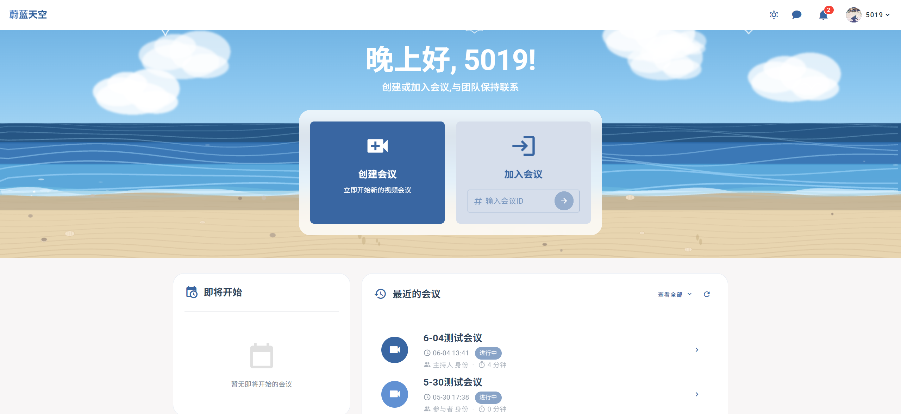
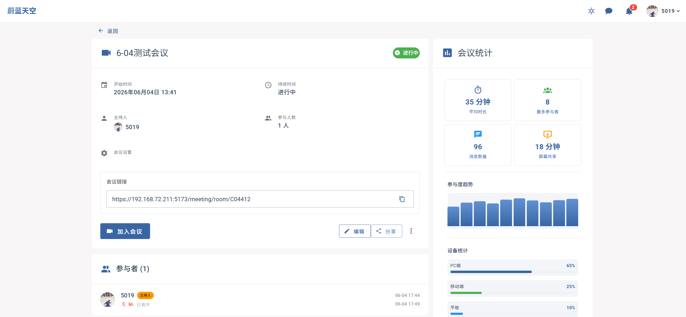
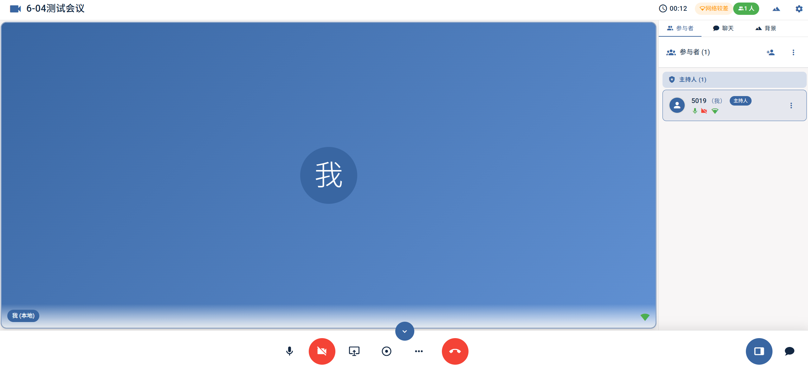

# Design and Implementation of a WebRTC-Based Real-Time Video Conferencing System

> Undergraduate thesis implementation · Open source repository: [github.com/294916437/theoyu-thesis](https://github.com/294916437/theoyu-thesis)

[中文文档](README.zh-CN.md)

## Overview

This repository contains the complete engineering implementation for an undergraduate thesis project. It focuses on the design, implementation, and performance optimization of a real-time video conferencing system based on WebRTC and WebAssembly, covering SFU-based multi-party audio and video, client-side video processing, and heterogeneous microservice communication.

## Technology Stack

| Layer | Technology | Description |
| --- | --- | --- |
| Frontend | Vue 3 + Vuetify + Pinia + Vite | User interface |
| Frontend communication | mediasoup-client + Socket.io-client + StompJS | WebRTC client and signaling |
| Frontend rendering | Pixi.js | Welcome page animation |
| Android client | Kotlin + Jetpack Compose + Material 3 | Native mobile meeting client, planned initialization |
| Business backend | Spring Cloud Alibaba + MySQL + Redis | Microservice business logic |
| Message queue | RocketMQ | Asynchronous message processing |
| Service registry | Nacos | Service discovery and configuration center |
| Storage | MinIO + Cassandra | Object storage and meeting text data |
| SFU service | Node.js + Mediasoup + Socket.io | Media forwarding service |
| Cross-language communication | gRPC | Spring Cloud to SFU communication |
| Client-side processing | Rust to WebAssembly | Browser-side video background segmentation |

## Key Features

- [x] Multi-party real-time audio and video conferencing, built on a Mediasoup SFU with adaptive bandwidth support
- [x] Client-side video processing, including background blur and background replacement through Rust-compiled WebAssembly
- [x] Screen sharing
- [x] Meeting recording and playback, persisted to MinIO
- [x] P2P audio and video calls for private chat scenarios, based on direct WebRTC connections
- [x] Meeting room chat and file sharing
- [x] Private messaging center with text, files, and P2P audio/video
- [x] Host permission controls, including mute, remove participant, mute all, and turn off all cameras
- [x] Meeting participant list and real-time status
- [x] Meeting statistics and monitoring
- [ ] Native Android multi-party meeting client

## Preview

### Home



### Meeting Details



### Meeting Room



## Project Structure

```text
theoyu-thesis/
├── web/                              # Vue 3 frontend
│   └── src/
│       ├── features/                 # Business modules: meeting, chat, user
│       ├── components/               # Shared components
│       ├── stores/                   # Pinia state management
│       ├── services/                 # WebRTC, Socket.io, and Stomp service layer
│       ├── composables/              # Composables
│       ├── api/                      # HTTP API wrappers
│       └── utils/                    # Utilities
│
├── backend/                          # Spring Cloud microservice backend
│   ├── thesis-gateway/               # API gateway: authentication and routing
│   ├── thesis-auth/                  # Authentication and authorization service
│   ├── thesis-user/                  # User management service
│   ├── thesis-media/                 # Meeting management service
│   ├── thesis-chat/                  # Chat service: private chat and room chat
│   ├── thesis-kv/                    # KV cache service: Redis wrapper
│   ├── thesis-oss/                   # Object storage service: MinIO wrapper
│   ├── thesis-id-generator/          # Distributed ID generation service
│   └── thesis-framework/             # Shared framework: common, logger, jackson
│
├── sfu/                              # Node.js SFU service: TypeScript
│   ├── src/
│   │   ├── core/                     # Room, Peer, and Mediasoup core management
│   │   ├── features/                 # Socket handlers, gRPC server, recording, monitoring, latency collection
│   │   ├── config/                   # Service configuration
│   │   └── utils/                    # Utilities
│   └── proto/                        # gRPC protocol definitions: .proto files
│
├── wasm/                             # Rust to WebAssembly client-side video processing
│   └── src/
│       ├── lib.rs                    # Background blur and background replacement implementation
│
├── android/                          # Native Android client, manually initialized with Android Studio
│   ├── AGENTS.md                     # Android development rules
│   └── README.md                     # Android initialization entry
│
├── test/                             # Performance test suites
│   ├── concurrent-stress/            # SFU concurrent stress tests
│   ├── e2e-latency/                  # End-to-end latency tests
│   ├── edge-side-performance-comparison/  # Client-side processing performance comparison
│   └── jmeter-test/                  # Microservice API stress tests
│
├── deploy/                           # Deployment configuration
│   ├── docker/                       # Docker Compose and service image configuration
│   ├── script/                       # Deployment scripts
│   └── sql/                          # Database initialization scripts
│
├── demos/                            # Standalone demos for WebAssembly client-side effects
└── docs/                             # Project documentation
```

## Quick Start

### Requirements

- Node.js >= 22
- JDK >= 17
- Rust + wasm-pack
- Docker, used for middleware deployment
- Android Studio + Android SDK for Android client development

### Backend Development

```bash
cd backend
mvn clean install
mvn spring-boot:run
```

### Frontend Development

```bash
cd web
npm install
npm run dev
```

### Android Client

Create the Android project manually with Android Studio under `android/`. See [Android initialization guide](docs/android-initialization.md) for package name, module structure, and WebRTC/Mediasoup integration boundaries.

### SFU Service

```bash
cd sfu
npm install
npm run dev
```

### Build the WebAssembly Module

```bash
cd wasm
wasm-pack build --target web
```

## Research Focus

1. SFU-based multi-party real-time audio and video, with adaptive bandwidth and multi-stream media forwarding.
2. Client-side video background segmentation and real-time processing performance optimization with Rust compiled to WebAssembly.
3. Cross-language gRPC communication between Spring Cloud Alibaba and Node.js heterogeneous microservices.
4. WebRTC-based P2P audio/video calls and signaling design.
5. Meeting permission control and host management mechanisms.

## Development Progress

- [x] Requirements analysis and system design
- [x] WebRTC core feature implementation
- [x] SFU server implementation
- [x] Spring Cloud microservice business features
- [x] WebAssembly module development
- [x] Performance testing and optimization
- [x] Thesis writing
- [ ] Native Android client initialization and core meeting pipeline integration

## License

This project is licensed under the [GNU General Public License v3.0 or later](https://www.gnu.org/licenses/gpl-3.0.html).

see more info in [LICENSE](./LICENSE) file

SPDX-License-Identifier: GPL-3.0-or-later

## Author

Undergraduate thesis project

Copyright (C) 2025-2026 **[Theoyu Du](https://github.com/294916437)**
